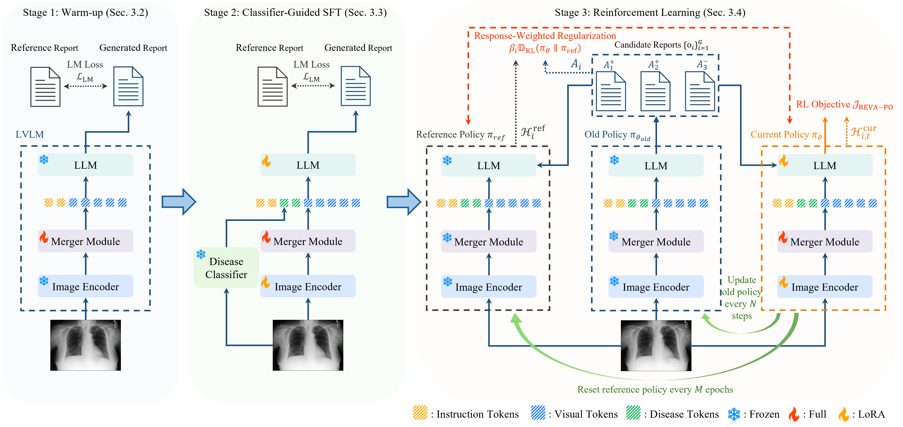
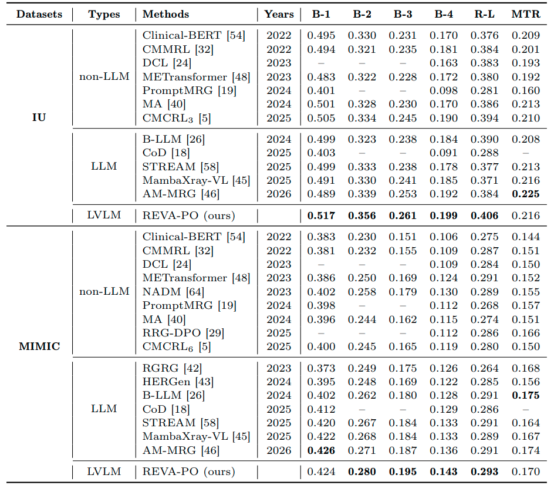
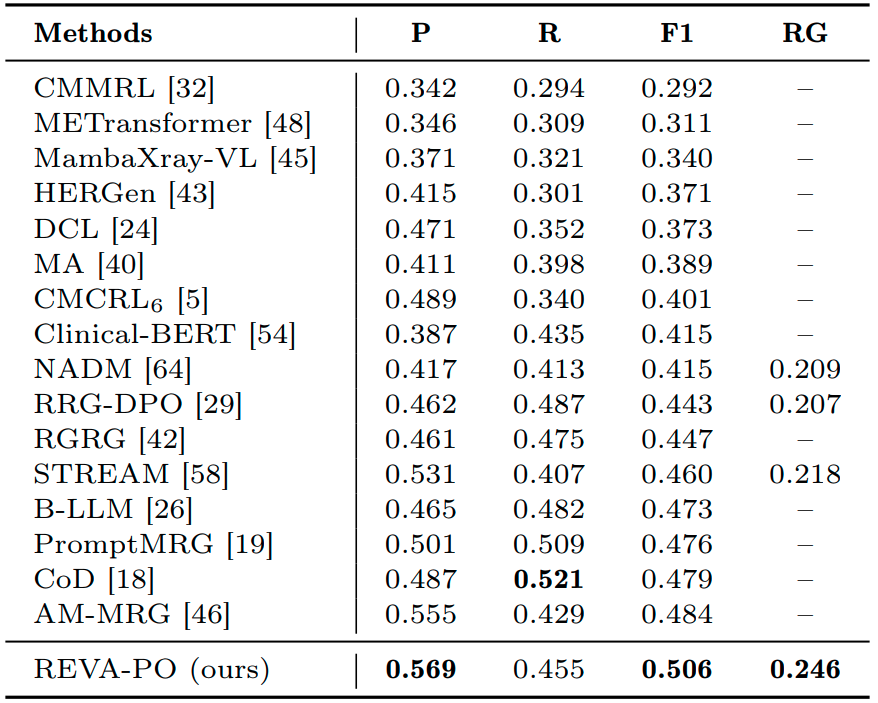

# REVA-PO: Stabilizing Reinforcement Learning for Chest X-ray Report Generation

**Accepted to ECCV 2026**

[](https://arxiv.org/abs/2607.10147)
[](https://huggingface.co/liguo12/REVA_PO_Weights)
[](https://huggingface.co/datasets/liguo12/REVA_PO_Datasets)

## Overview



## Installation

**1. Install requirements**

Install requirements using pip:

```bash
pip install -r requirements.txt
```

**2. Preparation**

### Datasets

IU-Xray: Download the [IU-Xray](https://huggingface.co/datasets/liguo12/REVA_PO_Datasets/tree/main/iuxray_dataset) and unzip `images.zip`. 

After unzip, the folder looks like:

```text
iuxray_dataset/
├── images/
└── annotation_with_categories.json
```

MIMIC-CXR: Download the images of MIMIC-CXR dataset from [official website](https://physionet.org/content/mimic-cxr-jpg/2.0.0/), and download the [annotations](https://huggingface.co/datasets/liguo12/REVA_PO_Datasets/tree/main/mimic_dataset).

Put the annotations and images (files) from the official website into the same folder.

```text
mimic_dataset/
├── files/
├── mimic_with_categories.json/
└── mimic_with_categories_sampled_10k.json/
```
### Pretrained Checkpoints

IU-Xray: Download our pretrained checkpoints for IU-Xray from [here](https://huggingface.co/liguo12/REVA_PO_Weights/tree/main/iuxray).

MIMIC-CXR: Download our pretrained checkpoints for MIMIC-CXR from [here](https://huggingface.co/liguo12/REVA_PO_Weights/tree/main/mimic).

## Evaluation

**1. IU-Xray**

After downloading the datasets and the pre-trained checkpoints, update:

`train_configs/stage3/iuxray_stage3.yaml`

Set these fields to your local paths:

- `pretrained_cls_ckp` (line 40): path to `iuxray_cls_ckpt.pth`
- `pretrained_stage2` (line 41): path to `iuxray_stage2_ckpt.pth`
- `pretrained_stage3` (line 42): path to `iuxray_stage3_ckpt.pth`
- `storage` (line 51): path to `iuxray_dataset/`
- `ann_file` (line 52): path to `iuxray_dataset/annotation_with_categories.json`

We used 8 V100 GPUs. Adjust the following settings based on the number of GPUs available:

- `train_configs/stage3/iuxray_stage3.yaml`: `world_size` (line 74)
- `train_configs/stage3/zero_iuxray_stage3.json`: `train_batch_size` (line 34)

Run:

```bash
deepspeed --num_gpus 8 train.py \
  --cfg-path train_configs/stage3/iuxray_stage3.yaml \
  --use_zero_optimizer \
  --deepspeed_config train_configs/stage3/zero_iuxray_stage3.json
```

**2. MIMIC-CXR**

Update:

`train_configs/stage3/mimic_stage3.yaml`

Set these fields to your local paths:

- `chexbert_ckpt` (line 39): path to `chexbert.pth`
- `pretrained_cls_ckp` (line 42): path to `mimic_cls_ckpt.pth`
- `pretrained_stage2` (line 43): path to `mimic_stage2_ckpt.pth`
- `pretrained_stage3` (line 44): path to `mimic_stage3_ckpt.pth`
- `storage` (line 53): path to `mimic_dataset/`
- `ann_file` (line 54): path to `mimic_dataset/mimic_with_categories_sampled_10k.json`

Adjust the following settings based on the number of GPUs available:

- `train_configs/stage3/mimic_stage3.yaml`: `world_size` (line 76)
- `train_configs/stage3/zero_mimic_stage3.json`: `train_batch_size` (line 34)

Run:

```bash
deepspeed --num_gpus 8 train.py \
  --cfg-path train_configs/stage3/mimic_stage3.yaml \
  --use_zero_optimizer \
  --deepspeed_config train_configs/stage3/zero_mimic_stage3.json
```
## Results

### Main Results

<p align="center">
  
</p>

### MIMIC Clinical Efficacy Results

<p align="center">
  
</p>

## Training

If you want to retrain the models or rerun a specific stage, refer to the following section.

### MIMIC-CXR
#### Stage 1
Update:

`train_configs/stage1/mimic_stage1.yaml`

Set these fields to your local paths:
pretrained_stage2
- `storage` (line 22): path to `mimic_dataset/`
- `ann_file` (line 23): path to `mimic_dataset/mimic_with_categories.json`

Adjust the following settings based on the number of GPUs available:

- `train_configs/stage1/mimic_stage1.yaml`: `world_size` (line 45)
- `train_configs/stage1/zero_mimic_stage1.json`: `train_batch_size` (line 34)

Run:

```bash
deepspeed --num_gpus 4 train.py \
  --cfg-path train_configs/stage1/mimic_stage1.yaml \
  --use_zero_optimizer \
  --deepspeed_config train_configs/stage1/zero_mimic_stage1.json
```

#### Stage 2
Update:

`train_configs/stage2/mimic_stage2.yaml`

Set these fields to your local paths:

- `pretrained_cls_ckp` (line 25): path to `mimic_cls_ckpt.pth`
- `pretrained_stage1` (line 26): path to `mimic_stage1_ckpt.pth`
  
  Note: This line can be either a checkpoint we provide or a stage 1 checkpoint from your previous training.
- `storage` (line 36): path to `mimic_dataset/`
- `ann_file` (line 37): path to `mimic_dataset/mimic_with_categories.json`

Adjust the following settings based on the number of GPUs available:

- `train_configs/stage2/mimic_stage2.yaml`: `world_size` (line 59)
- `train_configs/stage2/zero_mimic_stage2.json`: `train_batch_size` (line 34)

Run:

```bash
deepspeed --num_gpus 4 train.py \
  --cfg-path train_configs/stage2/mimic_stage2.yaml \
  --use_zero_optimizer \
  --deepspeed_config train_configs/stage2/zero_mimic_stage2.json
```

#### Re-fine-tune Classifier

If you want to re-fine-tune the classifier, download the pretained [Medical_MAE](https://huggingface.co/liguo12/REVA_PO_Weights/tree/main/Medical_MAE). Alternatively, you can download it from the [official repo](https://github.com/lambert-x/medical_mae). The classifiers we used (`mimic_cls_ckpt.pth` and `iuxray_cls_ckpt.pth`) were obtained by fine-tuning Medical_MAE on MIMIC-CXR and IU-Xray, respectively.

update:

`train_configs/stage2_cls/mimic_stage2_cls.yaml`

Set these fields to your local paths:

- `vit_ckpt` (line 11): path to `vit-b_CXR_0.5M_mae_CheXpert.pth`
- `storage` (line 20): path to `mimic_dataset/`
- `ann_file` (line 21): path to `mimic_dataset/mimic_with_categories.json`

Adjust the following settings based on the number of GPUs available:

- `train_configs/stage2_cls/mimic_stage2_cls.yaml`: `world_size` (line 47)
- `train_configs/stage2_cls/zero_mimic_stage2_cls.json`: `train_batch_size` (line 26)

Run:

```bash
deepspeed --num_gpus 8 train.py \
  --cfg-path train_configs/stage2_cls/mimic_stage2_cls.yaml \
  --use_zero_optimizer \
  --deepspeed_config train_configs/stage2_cls/zero_mimic_stage2_cls.json
```

#### Stage 3
Update:

`train_configs/stage3/mimic_stage3.yaml`

Set these fields to your local paths:

- `evaluate` (line 46): set to False
- `pretrained_cls_ckp` (line 42): path to `mimic_cls_ckpt.pth`
- `pretrained_stage2` (line 43): path to `mimic_stage2_ckpt.pth`
  
  Note: This line can be either a checkpoint we provide or a stage 2 checkpoint from your previous training.
- `storage` (line 53): path to `mimic_dataset/`
- `ann_file` (line 54): path to `mimic_dataset/mimic_with_categories_sampled_10k.json`
  
  Note: This includes randomly sampling 10K instances from the MIMIC-CXR training split to reduce the runtime of RL training. The validation and test splits remain unchanged.

Adjust the following settings based on the number of GPUs available:

- `train_configs/stage3/mimic_stage3.yaml`: `world_size` (line 76)
- `train_configs/stage2/zero_mimic_stage2.json`: `train_batch_size` (line 34)

Run:

```bash
deepspeed --num_gpus 8 train.py \
  --cfg-path train_configs/stage3/mimic_stage3.yaml \
  --use_zero_optimizer \
  --deepspeed_config train_configs/stage3/zero_mimic_stage3.json
```

### IU-Xray
#### Stage 1
Update:

`train_configs/stage1/iuxray_stage1.yaml`

Set these fields to your local paths:

- `pretrained_stage1_mimic` (line 14): path to `mimic_stage1_ckpt.pth`

  Note: For IU-Xray Stage 1, we initialize from the MIMIC-CXR Stage 1 checkpoint because the IU-Xray dataset is small.
- `storage` (line 23): path to `iuxray_dataset/`
- `ann_file` (line 24): path to `iuxray_dataset/annotation_with_categories.json`

Adjust the following settings based on the number of GPUs available:

- `train_configs/stage1/iuxray_stage1.yaml`: `world_size` (line 46)
- `train_configs/stage1/zero_iuxray_stage1.json`: `train_batch_size` (line 35)

Run:

```bash
deepspeed --num_gpus 4 train.py \
  --cfg-path train_configs/stage1/iuxray_stage1.yaml \
  --use_zero_optimizer \
  --deepspeed_config train_configs/stage1/zero_iuxray_stage1.json
```

#### Stage 2
Update:

`train_configs/stage2/iuxray_stage2.yaml`

Set these fields to your local paths:

- `pretrained_cls_ckp` (line 25): path to `iuxray_cls_ckpt.pth`
- `pretrained_stage1` (line 26): path to `iuxray_stage1_ckpt.pth`
  
  Note: This line can be either a checkpoint we provide or a stage 1 checkpoint from your previous training.
- `storage` (line 36): path to `iuxray_dataset/`
- `ann_file` (line 37): path to `iuxray_dataset/annotation_with_categories.json`

Adjust the following settings based on the number of GPUs available:

- `train_configs/stage2/iuxray_stage2.yaml`: `world_size` (line 59)
- `train_configs/stage2/zero_iuxray_stage2.json`: `train_batch_size` (line 34)

Run:

```bash
deepspeed --num_gpus 4 train.py \
  --cfg-path train_configs/stage2/iuxray_stage2.yaml \
  --use_zero_optimizer \
  --deepspeed_config train_configs/stage2/zero_iuxray_stage2.json
```

#### Re-fine-tune Classifier

The IU-Xray classifier is obtained by fine-tuning the MIMIC-CXR classifier.

update:

`train_configs/stage2_cls/iuxray_stage2_cls.yaml`

Set these fields to your local paths:

- `vit_ckpt` (line 11): path to `vit-b_CXR_0.5M_mae_CheXpert.pth`
- `pretrained_cls_ckpt_mimic`（line 12): path to `mimic_cls_ckpt.pth`

   Note: This is MIMIC-CXR classifier.
- `storage` (line 21): path to `iuxray_dataset/`
- `ann_file` (line 22): path to `iuxray_dataset/annotation_with_categories.json`

Adjust the following settings based on the number of GPUs available:

- `train_configs/stage2_cls/mimic_stage2_cls.yaml`: `world_size` (line 46)
- `train_configs/stage2_cls/zero_mimic_stage2_cls.json`: `train_batch_size` (line 26)

Run:

```bash
deepspeed --num_gpus 8 train.py \
  --cfg-path train_configs/stage2_cls/iuxray_stage2_cls.yaml \
  --use_zero_optimizer \
  --deepspeed_config train_configs/stage2_cls/zero_iuxray_stage2_cls.json
```

#### Stage 3
Update:

`train_configs/stage3/iuxray_stage3.yaml`

Set these fields to your local paths:

- `use_chexbert` (line 40): set to True
- `chexbert_ckpt` (line 41): path to `chexbert_ckpt.pth`
- `evaluate` (line 44): set to False
- `pretrained_cls_ckp` (line 43): path to `iuxray_cls_ckpt.pth`
- `pretrained_stage2` (line 44): path to `iuxray_stage2_ckpt.pth`
  
  Note: This line can be either a checkpoint we provide or a stage 2 checkpoint from your previous training.
- `storage` (line 51): path to `iuxray_dataset/`
- `ann_file` (line 52): path to `iuxray_dataset/annotation_with_categories.json`
  
Adjust the following settings based on the number of GPUs available:

- `train_configs/stage3/iuxray_stage3.yaml`: `world_size` (line 74)
- `train_configs/stage2/zero_iuxray_stage2.json`: `train_batch_size` (line 34)

Run:

```bash
deepspeed --num_gpus 8 train.py \
  --cfg-path train_configs/stage3/iuxray_stage3.yaml \
  --use_zero_optimizer \
  --deepspeed_config train_configs/stage3/zero_iuxray_stage3.json
```

## Citation

If you find our work helpful, please cite:

```bibtex
@misc{guo2026revapo,
      title={REVA-PO: Stabilizing Reinforcement Learning for Chest X-ray Report Generation}, 
      author={Li Guo and Anas M. Tahir and Z. Jane Wang},
      year={2026},
      eprint={2607.10147},
      archivePrefix={arXiv},
      primaryClass={cs.CV},
      url={https://arxiv.org/abs/2607.10147}, 
}
```
